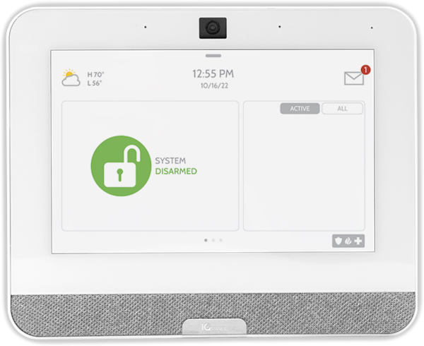

# Qolsys IQ Binding

This binding directly controls a [Qolsys IQ](https://qolsys.com/security/) security panel.  This allows both local monitoring of alarms and zone status as well as arming, disarming and triggering alarms.



## Supported Things

- `Qolsys IQ Panel Bridge`: A Qolsys panel (all current models, which is 2 and 4 at the time of writing). Uses the ThingTypeUID `panel`
- `Qolsys IQ Partition Bridge`: A logical partition which can be armed, disarmed, and is responsible for managing zones. Uses the ThingTypeUID `partition`
- `Qolsys IQ Zone Thing`: A generic zone sensor.  Uses the ThingTypeUID `zone`

## Discovery

### Qolsys IQ Panel (Bridge)

The Qolsys IQ Panel must be manually added using a host name or ip address along with a secure access token from the panel settings.  To enable 3rd party control and retrieve the access token follow the following steps on the security panel touch screen:

`Settings` --> `Advanced Settings` --> `Installation` --> `Dealer Settings` -> `6 Digit User Code` (set to enabled)

`Settings` --> `Advanced Settings` --> `Installation` --> `Devices` --> `Wi-Fi Devices` --> `Control4` (set to enabled)

Panel will reboot

`Settings` --> `Advanced Settings` --> `Installation` --> `Devices` --> `Wi-Fi Devices` --> `Reveal Secure Token` (copy token to use in panel configuration)

### Partition (Bridge)

Once a panel is added, partitions will be automatically discovered and appear in the inbox.

### Zone (Thing)

Zones will be automatically discovered and appear in the inbox once their parent partition has been added.

## Thing Configuration

### `panel` Thing Configuration

| Name              | Type    | Description                                         | Default | Required | Advanced |
|-------------------|---------|-----------------------------------------------------|---------|----------|----------|
| hostname          | text    | Hostname or IP address of the device                | N/A     | yes      | no       |
| port              | integer | Port the device is listening on                     | 12345   | yes      | no       |
| key               | text    | Access token / key found in the panel settings menu | N/A     | yes      | no       |
| heartbeatInterval | integer | Interval we send heart beat messages in seconds     | 30      | yes      | yes      |

### `partition` Thing Configuration

| Name    | Type    | Description                                                                                               | Default | Required | Advanced |
|---------|---------|-----------------------------------------------------------------------------------------------------------|---------|----------|----------|
| id      | integer | Partition id of the panel, staring with '0' for the first partition                                       | N/A     | yes      | no       |
| armCode | text    | Optional Arm / Disarm code to use when receiving commands without a code.  Leave blank to require a code  | blank   | no       | no       |

### `zone` Thing Configuration

| Name    | Type    | Description                                                                                             | Default | Required | Advanced |
|---------|---------|---------------------------------------------------------------------------------------------------------|---------|----------|----------|
| id      | integer | Zone id of the zone, staring with '1' for the first zone                                                | N/A     | yes      | no       |

## Channels

### Panel Channels

None.

### Partition Channels

| Channel        | Type    | Read/Write | Description                                                                                                                                                                           | State Options                                              | Command Options            |
|----------------|---------|------------|---------------------------------------------------------------------------------------------------------------------------------------------------------------------------------------|------------------------------------------------------------|----------------------------|
| armState       | String  | RW         | Reports the current partition arm state or sends an arm or disarm command to the system. Security codes can be appended to the command using a colon delimiter (e.g. 'DISARM:123456') | ALARM, ARM_AWAY, ARM_STAY, DISARM, ENTRY_DELAY, EXIT_DELAY | ARM_AWAY, ARM_STAY, DISARM |
| alarmState     | String  | RW         | Reports on the current alarm state, or triggers an instant alarm                                                                                                                      | AUXILIARY, FIRE, POLICE, ZONEOPEN, NONE                    | AUXILIARY, FIRE, POLICE    |
| armingDelay    | Number  | R          | The arming delay currently in progress                                                                                                                                                | Seconds remaining                                          |                            |
| alarmPolice    | Contact | R          | On if police alarm is active                                                                                                                                                          | ON, OFF                                                    |                            |
| alarmFire      | Contact | R          | On if fire alarm is active                                                                                                                                                            | ON, OFF                                                    |                            |
| alarmNone      | Contact | R          | On if no alarm is active                                                                                                                                                              | ON, OFF                                                    |                            |
| alarmAuxiliary | Contact | R          | On if auxiliary alarm is active                                                                                                                                                       | ON, OFF                                                    |                            |
| alarmZone      | Contact | R          | On if zone alarm is active                                                                                                                                                            | ON, OFF                                                    |                            |

### Zone Channels

| Channel | Type    | Read/Write | Description            | State Options                               | 
|---------|---------|------------|------------------------|---------------------------------------------|
| status  | String  | R          | The zone status        | ACTIVE, CLOSED, OPEN, FAILURE, IDLE, TAMPER |
| state   | Number  | R          | The zone state         | Number of state                             |
| contact | Contact | R          | The zone contact state | OPEN, CLOSED                                |

## Full Example

### qolsysiq.things

```
Bridge qolsysiq:panel:home "Home Security Panel" [ hostname="192.168.3.123", port=12345, key="AAABBB00", heartbeatInterval=30 ] {
    Bridge partition 0 "Partition Main" [ id=0, armCode="123456" ] {
        Thing zone 0 "Window" [ id="0" ]
        Thing zone 1 "Motion" [ id="1" ]
    }
}
```

### qolsysiq.items

Sample items file with both Alexa and Homekit voice control

```
Group:Contact:OR(OPEN, CLOSED)    QolsysIQPartitionMain_ZoneContacts               "Alarm System Contacts"

Group                             QolsysIQPartitionMain                            "Alarm System"                                                                                                                     ["Equipment"]    {alexa="SecurityPanel", homekit = "SecuritySystem"}

String                            QolsysIQPartitionMain_PartitionArmState          "Partition Arm State"                        <Alarm>    (QolsysIQPartitionMain)                                                    ["Point"]        {channel="qolsysiq:partition:home:0:armState", alexa="ArmState" [DISARMED="DISARM",ARMED_STAY="ARM_STAY",ARMED_AWAY="ARM_AWAY:EXIT_DELAY"], homekit = "SecuritySystem.CurrentSecuritySystemState,SecuritySystem.TargetSecuritySystemState" [STAY_ARM="ARM_STAY", AWAY_ARM="ARM_AWAY", DISARM="DISARM", DISARMED="DISARM", TRIGGERED="ALARM"]}
String                            QolsysIQPartitionMain_PartitionAlarmState        "Partition Alarm State"                      <Alarm>    (QolsysIQPartitionMain)                                                    ["Point"]        {channel="qolsysiq:partition:home:0:alarmState"}
Number                            QolsysIQPartitionMain_PartitionArmingDelay       "Partition Arming Delay"                     <Alarm>    (QolsysIQPartitionMain)                                                    ["Point"]        {channel="qolsysiq:partition:home:0:armingDelay"}
Switch                            QolsysIQPartitionMain_PoliceAlarmActive          "Police Alarm Active"                        <Alarm>    (QolsysIQPartitionMain)                                                    ["Point"]        {channel="qolsysiq:partition:home:0:alarmPolice", alexa="BurglaryAlarm"}
Switch                            QolsysIQPartitionMain_FireAlarmActive            "Fire Alarm Active"                          <Alarm>    (QolsysIQPartitionMain)                                                    ["Point"]        {channel="qolsysiq:partition:home:0:alarmFire", alexa="FireAlarm"}
Switch                            QolsysIQPartitionMain_NoAlarmActive              "No Alarm Active"                            <Alarm>    (QolsysIQPartitionMain)                                                    ["Point"]        {channel="qolsysiq:partition:home:0:alarmNone"}
Switch                            QolsysIQPartitionMain_AuxiliaryAlarmActive       "Auxiliary Alarm Active"                     <Alarm>    (QolsysIQPartitionMain)                                                    ["Point"]        {channel="qolsysiq:partition:home:0:alarmAuxiliary", alexa="AlarmAlert"}
Switch                            QolsysIQPartitionMain_ZoneAlarmActive            "Zone Alarm Active"                          <Alarm>    (QolsysIQPartitionMain)                                                    ["Point"]        {channel="qolsysiq:partition:home:0:alarmZone", alexa="ZonesAlert"}

Group                             QolsysIQZoneKitchenWindows                       "Qolsys IQ Zone: Kitchen Windows"                                                                                                  ["Equipment"]
Number                            QolsysIQZoneKitchenWindows_ZoneState             "Kitchen Windows Zone State"                            (QolsysIQZoneKitchenWindows)                                               ["Point"]        {channel="qolsysiq:zone:home:0:1:state"}
String                            QolsysIQZoneKitchenWindows_ZoneStatus            "Kitchen Windows Zone Status"                           (QolsysIQZoneKitchenWindows)                                               ["Point"]        {channel="qolsysiq:zone:home:0:1:status"}
Contact                           QolsysIQZoneKitchenWindows_ZoneContact           "Kitchen Windows Zone Contact"                          (QolsysIQZoneKitchenWindows, QolsysIQPartitionMain_ZoneContacts)           ["Point"]        {channel="qolsysiq:zone:home:0:1:contact"}

Group                             QolsysIQZoneMotionDetector1                      "Motion Detector 1"                                                                                                                ["Equipment"]
Number                            QolsysIQZoneMotionDetector_ZoneState1            "Motion Detector 1 Zone State"                          (QolsysIQZoneMotionDetector1)                                              ["Point"]        {channel="qolsysiq:zone:home:0:2:state"}
String                            QolsysIQZoneMotionDetector_ZoneStatus1           "Motion Detector 1 Zone Status"                         (QolsysIQZoneMotionDetector1)                                              ["Point"]        {channel="qolsysiq:zone:home:0:2:status"}
Contact    
```
